# Lógica difusa aplicada al diagnóstico médico

> Francisco Javier Bolívar Lupiáñez

## Introducción

En la medicina los médicos usan a veces variables precisas como pueden ser el peso, la altura, la frecuencia cardiaca en reposo, pero en la mayoría de las ocasiones usa otras con más vaguedad como puede ser el grado de dolor de cabeza que sufre el paciente, el ejercicio que realiza diariamente e incluso algunas de las variables precisas mencionadas anteriormente como la frecuencia cardiaca.

Es por esto que la aplicación de la lógica difusa en este campo ha tenido bastante importancia que se ve reflejada en el número de papers que se publican sobre esto [1]:

| Año  | Publicaciones |
| ---- | ------------- |
| 2000 | 96            |
| 2001 | 151           |
| 2002 | 119           |
| 2003 | 141           |
| 2004 | 182           |
| 2005 | 194           |
| 2006 | 277           |
| 2007 | 253           |
| 2008 | 290           |
| 2009 | 312           |
| 2010 | 306           |

## Proceso

El proceso de un sistema difuso cuenta con los siguiente pasos [2]:

## Un caso práctico. Diagnóstico de riesgo de enfermedad cardíaca

La medicina es un campo muy extenso y como se ha mencionado anteiormente el número de publicaciones que hacen uso de la lógica difusa para realizar un diagnóstico médico es enorme. De entre todas las posibilidades que he encontrado y decidido profundizar en un caso que se repite en dos publicaciones [3,4] ya que tengo la posibilidad de reproducirlo usando el *toolbox* de *Fuzzy Logic Designer* de MatLab para aprovechar y poder experimentar de forma práctica con la lógica difusa.

Se ha usado un *dataset* basado en los datos obtenidos en el V. A. Medical Center en Long Beach y la Cleveland Clinic Foundation y clasificados por la Universidad de California.

El propósito de este dataset es diagnosticar la presencia o ausencia de riesgo de enfermedad cardiaca que pueda tener un paciente. Originalmente el *dataset* contaba con 76 variables y 303 pacientes, pero para desarrollar este sistema difuso se han utilizado tan solo las nueve más significativas (8 de entrada y 1 de salida).

Las variables de entrada son:

| Variable                  | Unidad de medida |
| ------------------------- | ---------------- |
| Presión arterial          | mmHg             |
| Colesterol LDL            | mg/dl            |
| ECG                       | s                |
| Frecuencia cardiaca       | latidos/m        |
| Glucosa en sangre         | mg/dl            |
| Depresión del segmento ST | mV               |
| Escáner con talio         | -                |
| Edad                      | años             |

Y el de salida indica el porcentaje de riesgo de enfermedad cardiaca del individuo.

### Fuzzificar

El primer paso de todos es definir las *membership function* de cada variable para convertirlas en números difusos.

#### Entradas

Son todos los parámetros de entrada de un paciente que se *fuzzifican* como se determina a continuación:

##### Presión arterial sistólica

Valor máximo de presión arterial cuando el corazón se contrae (sístole). Se mide en milímetros de mercurio (mmHg).

La dividimos en cuatro valores difusos:

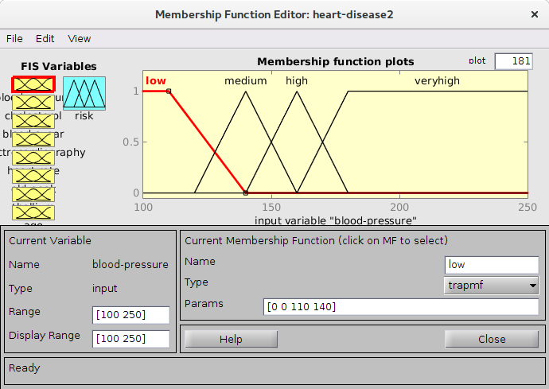

##### Colesterol LDL

Una mayor cantidad de colesterol LDL (*low-density lipoprotein*) se traduce en mayor riesgo de sufrir un ataque al corazón. Se mide en miligramos por decilitro de sangre (mg/dl).

Lo dividimos en cuatro valores difusos:

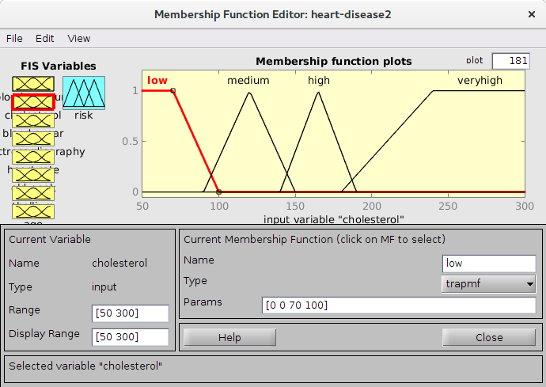

##### Electrocardiograma (ECG)

El ECG es la representación de la actividad eléctrica del corazón. Se obtiene con ultrasonido usando un electrocardiógrafo.

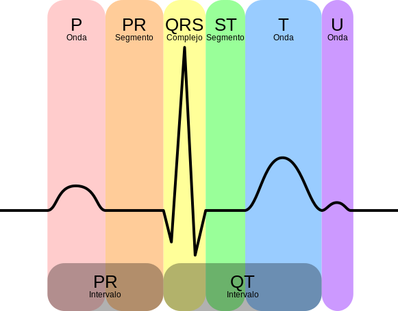

En nuestro caso se mide en segundos la duración del segmento ST y la onda T.

Lo dividimos en tres valores difusos:

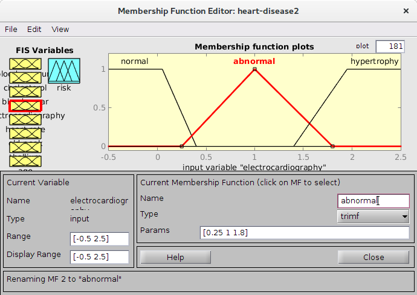

##### Frecuencia cardíaca

La frecuencia cardíaca es cuántas veces late el corazón por minuto. Se ha de medir en reposo.

Lo dividimos en tres valores difusos:

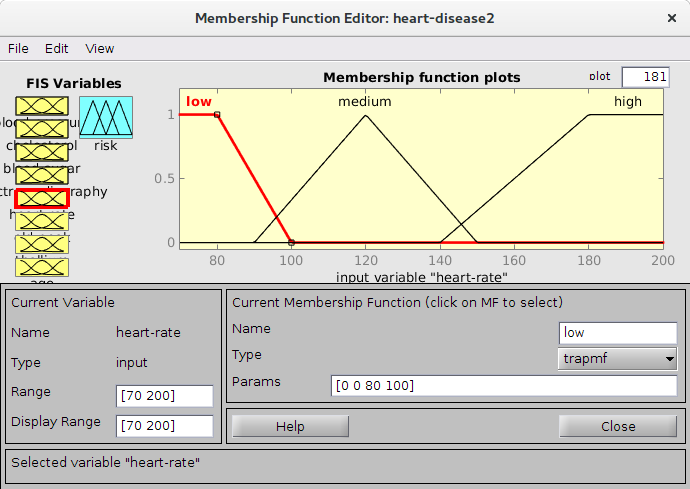

##### Glucosa en sangre

Una persona con más de 120 mg/dl de glucosa en sangre es diabética lo que aumenta el riesgo de que le produzca un ataque al corazón.

Vamos a usar un único valor difuso:

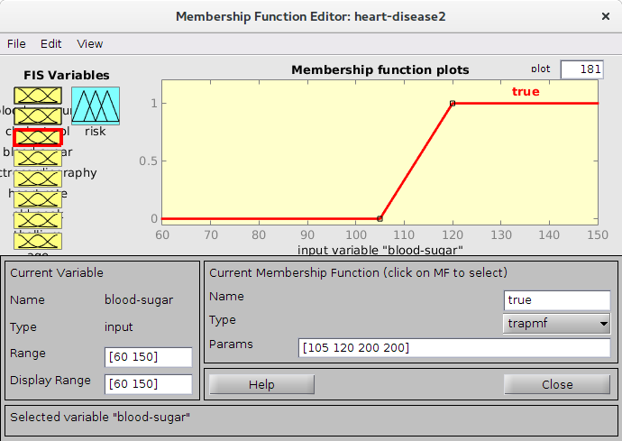

##### Depresión del segmento ST

Medir la depresión del segmento ST durante el ejercicio puede ayudar a pronosticar una enfermedad del corazón. A mayor sea este, más posibilidades de sufrir un ataque al corazón. Se mide en mili voltios (mV).

Se usarán tres variables difusas:

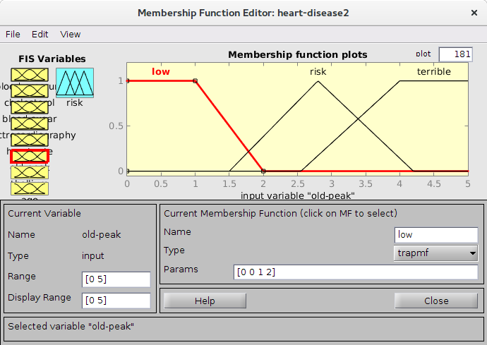

##### Escáner con talio

Con el escáner con talio se puede ver si zonas del corazón no reciben suficiente sangre.

Se utilizarán tres valores difusos:

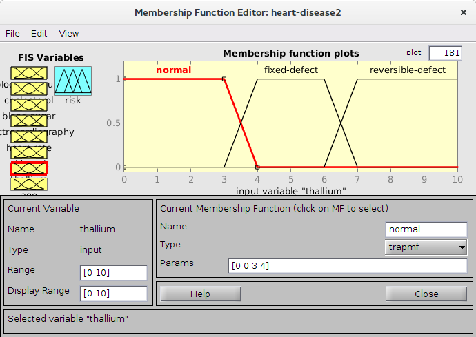

##### Edad

A más años tenga un individuo, mayor es la probabilidad de que sufra un ataque cardíaco.

Se usarán cuatro variables difusas:

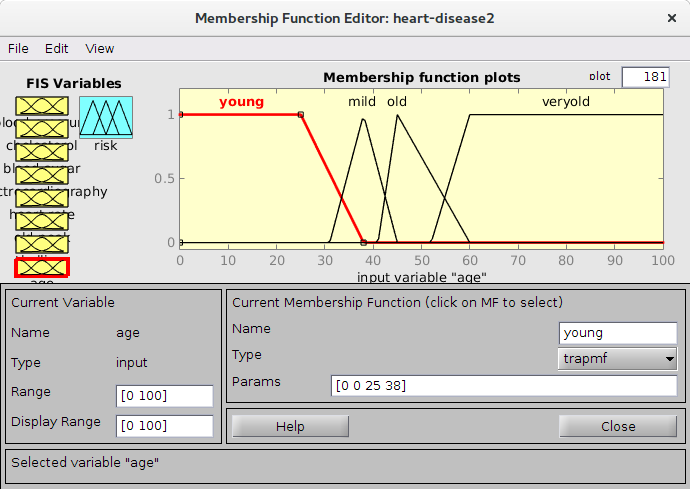

#### Salida

El sistema proveerá una única salida con el porcentaje de riesgo de ataque.

Para ello se usarán cinco variables difusas:

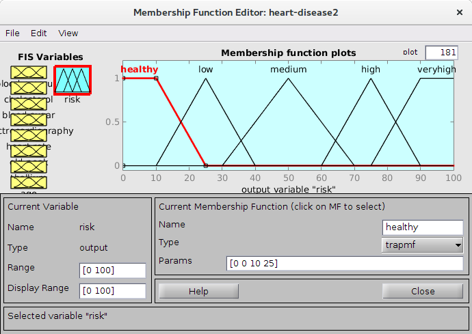

### Mecanismo de inferencia

Se utiliza el método de Mamdani como mecanismo de inferencia difuso ya que es el que proporciona MatLab. Este método tiene una estructurabastante simple con operaciones *min-max*:

* *OR*: max
* *AND*: min
* Agregación: max
* Implicación: min

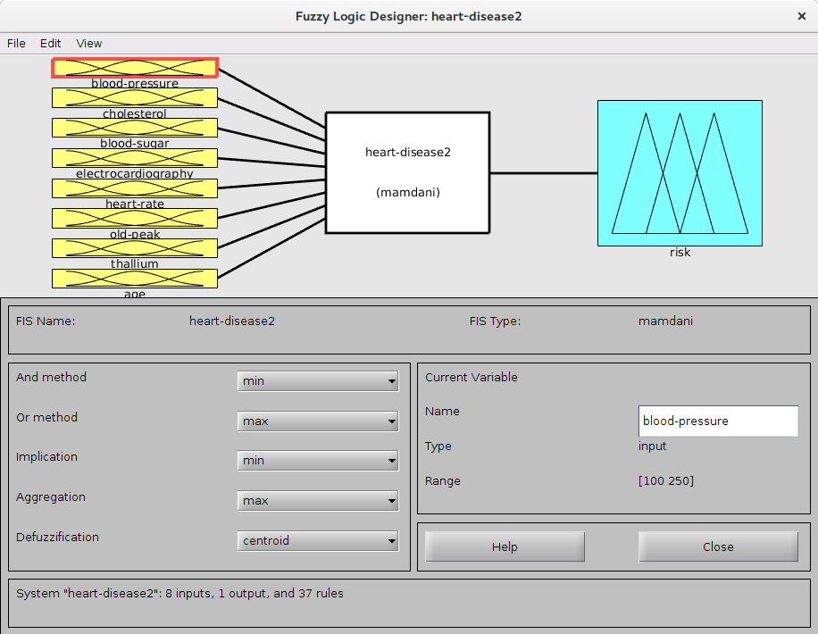

#### Reglas

Este mecanismo se basa en la definición de reglas de relaciones difusas. Por ejemplo: "Si la presión sanguínea es muy alta el riesgo es muy alto". A cada una de las reglas se le aplica un peso que determina el grado de validez de ésta.

Las reglas han sido creadas teniendo en cuenta tanto los resultados del *dataset* como por las opiniones de expertos.

### Defuzzificar

Para obtener un resultado en forma de porcentaje y no en forma de variable difusa hay que defuzzificar, para ello, se utiliza el método de centroide. Es un método muy simple que calcula el centro del área obtenida tras aplicar las reglas a los datos de entrada.

### Ejemplos de salidas

| Presión | Colesterol | Glucosa | ECG | Frec. cardiaca | Depr. ST | Talio | Edad | Riesgo |
| --  | --  | --  | --  | --  | --  | --  | --  | --  |
| a | b | c | d | e | f | g | h | i |
| a | b | c | d | e | f | g | h | i |
| a | b | c | d | e | f | g | h | i |
| a | b | c | d | e | f | g | h | i |

## Referencias

1. Patel, A., Gupta, S. K., Rehman, Q., & Verma, M. K. (2013). Application of Fuzzy Logic in Biomedical Informatics. *Journal of Emerging Trends in Computing and Information Sciences, 4*(1), 57-62.
2. Tarhini, A., Kočiš, L'. (1998). Fuzzy Approach in Psychiatry. *Psychiatria*, 80-86.
3. Sikchi, S. S., Sikchi, S., & Ali, M. S. (2013). Generic medical fuzzy expert system for diagnosis of cardiac diseases. *International Journal of Computer Applications, 66*(13).
4. Adeli, A., & Neshat, M. (2010, March). A fuzzy expert system for heart disease diagnosis. In *Proceedings of International Multi Conference of Engineers and Computer Scientists, Hong Kong* (Vol. 1).
